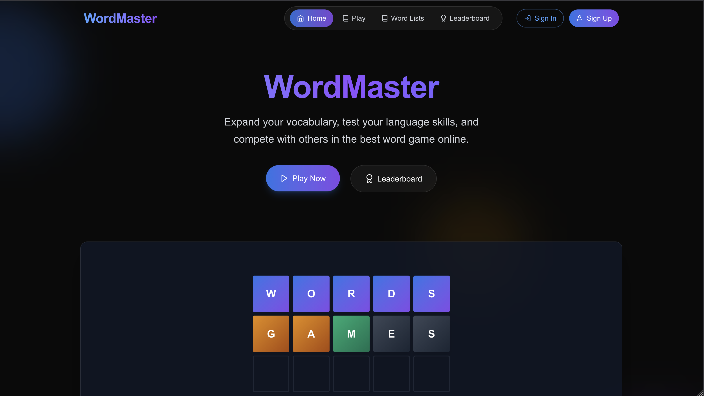
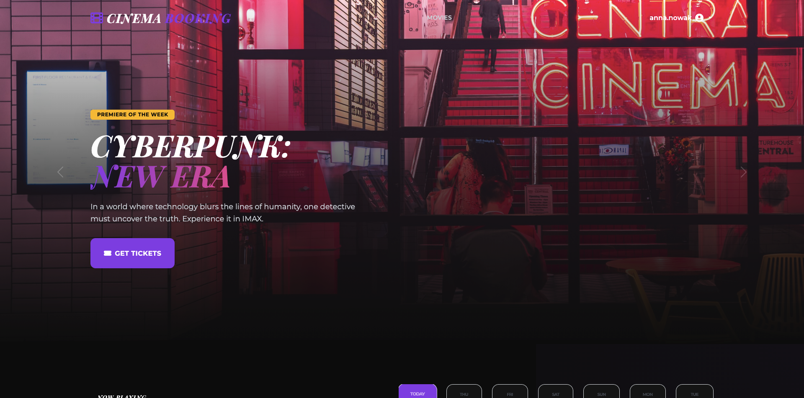
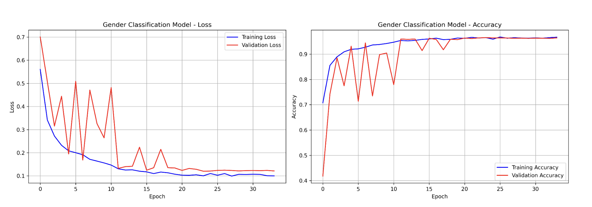
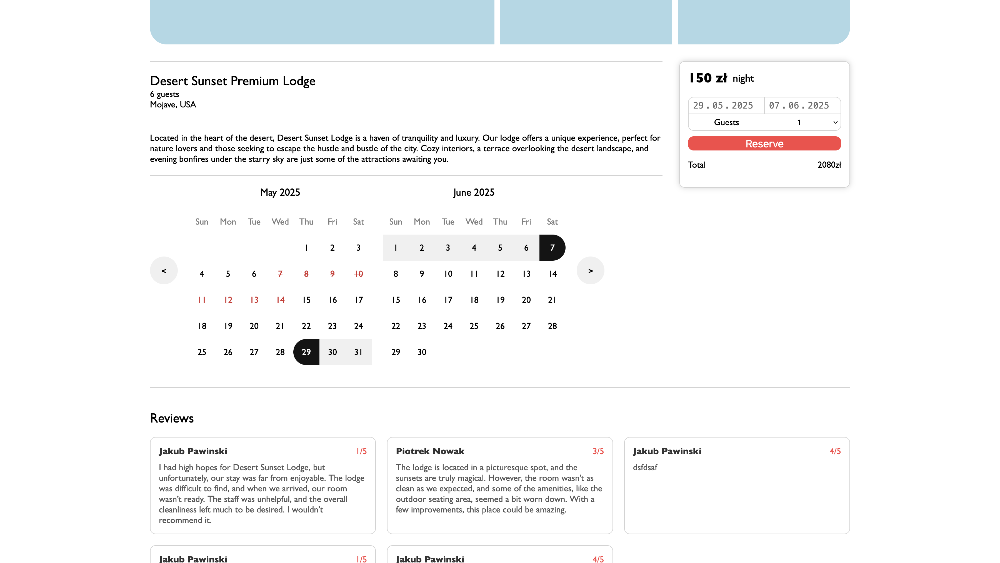

  <h1>Hi, I'm Jakub</h1>
  <h3><b>Aspiring Software Engineer | Backend Developer</b></h3>
  <i>Final year Computer Science student specializing in scalable systems & Intelligent Backend Solutions</i>
  
  

    
    
  

---

## 👨‍💻 About Me

I'm a final-year **Computer Science student** at the University of Gdańsk with a deep-rooted passion for **Backend Engineering** and **System Architecture**. While I can navigate the frontend, I feel most at home designing what's "under the hood."

My focus lies in building **high-performance APIs** and exploring how **Large Language Models (LLMs)** can be integrated to create intelligent, scalable systems. I don't just write code; I prioritize building "production-ready" solutions—meaning they are well-structured, containerized, and prepared to handle real traffic and real-world challenges.

- 🔭 **Current Focus:** Developing robust backend architectures with **NestJS**, **Spring Boot** and **Microservices**.
- 🤖 **AI Integration:** Exploring **LLMs** and building AI-powered features.
- ☁️ **Infrastructure:** Learning how to orchestrate services with **Kubernetes** and automating workflows.
- 🎯 **Goal:** Seeking a Junior/Intern role to build smart, scalable backend solutions.

---

## 🛠️ Tech Stack

### 🧱 Backend Stack

      

### 🗄️ Databases & Message Queues

    

### 🎨 Frontend Stack

     

### 🔧 Other Tools

      

---

## 🚀 Featured Projects

<table>
  <tr>
    <td align="center" width="50%">
      
       
      <b>GitCode.dev</b> 
      Educational platform built on a microservices architecture. The system automates portfolio building by synchronizing with the GitHub API and leverages LLMs for intelligent code analysis.
      
       
      🚀 <b>Microservices</b> • 🤖 <b>LLM Analysis</b> • 🐙 <b>GitHub API</b>
        
      🔗 <a href="https://github.com/JakubPawinski/GitCode.dev">Repo</a>
       
          
    </td>
    <td align="center" width="50%">
      
       
      <b>Wordle Game</b> 
      Cloud-native word game platform built with 7 microservices. Demonstrates professional practices including OAuth2/OIDC, async multiplayer, and a dual-database approach.
       
      🚀 <b>7 Microservices</b> • 🎮 <b>Async Multiplayer</b> • 🔐 <b>OAuth2/Keycloak</b>
        
      🔗 <a href="https://github.com/JakubPawinski/WordMaster">Repo</a>
       
               
    </td>

  </tr>
  <tr>
    <td align="center" width="50%">
      
       
      <b>Cinema booking</b> 
      Robust management system for cinema operations. Features an interactive seat map, automated PDF ticket generation with QR codes, and sales analytics.
       
      🧱 <b>Monolith</b> • 🎟️ <b>Interactive Booking</b> • 📄 <b>PDF Tickets</b> • 📊 <b>Admin Dashboard</b>
        
      🔗 <a href="https://github.com/JakubPawinski/Cinema-booking">Repo</a>
       
        
    </td>
    <td align="center" width="50%">
      
       
      <b>Chest X-ray Age & Gender Prediction</b> 
      Deep learning system for medical imaging. Implements multi-task learning to simultaneously predict patient age (regression) and gender (classification) using CNNs.
       
      🧠 <b>CNN</b> • 🫁 <b>Medical Imaging</b> • 📊 <b>Demographic Analysis</b>
        
      🔗 <a href="https://github.com/JakubPawinski/chest-xray-age-gender-prediction">Repo</a>
       
          
    </td>
  </tr>
  <tr>
    <td align="center" width="50%">
      
       
      <b>Quizz App</b>
       
      Feature-rich web application for creating and solving dynamic quizzes. Implements hybrid authentication, real-time game logic via custom hooks, and a complex multi-role admin panel.
       
      📝 <b>Quiz Builder</b> • 📊 <b>Progress Stats</b> • 🔐 <b>JWT/OAuth Auth</b>
        
      🔗 <a href="https://github.com/JakubPawinski/quizz-app">Repo</a>
       
        
    </td>
    <td align="center" width="50%">
      
       
      <b>Booking App</b>
       
      Comprehensive booking engine for property management. Features real-time availability, an internal messaging system, and automated MQTT-based notifications.
       
        📅 <b>Dynamic Calendar</b> • 💬 <b>Live Chat</b> • 📡 <b>MQTT / Sockets</b> • 🛡️ <b>JWT Auth</b>
        
      🔗 <a href="https://github.com/JakubPawinski/booking-app-bookastay">Repo</a>
       
        
    </td>
  </tr>
</table>

---

## 📊 GitHub Stats

  
  

## 📫 Get in Touch

- **GitHub:** [github.com/JakubPawinski](https://github.com/JakubPawinski)
- **Email:** [j.pawinski10@gmail.com](mailto:j.pawinski10@gmail.com)
- **LinkedIn:** [Jakub Pawiński](https://www.linkedin.com/in/jakub-pawi%C5%84ski-5128a32bb/)
